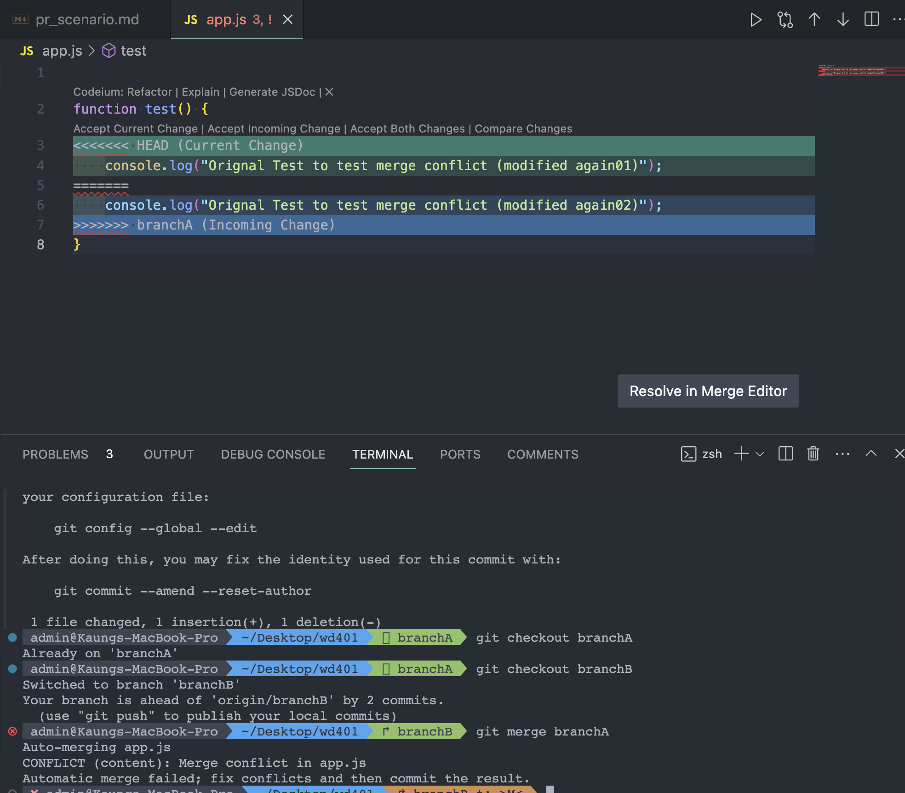
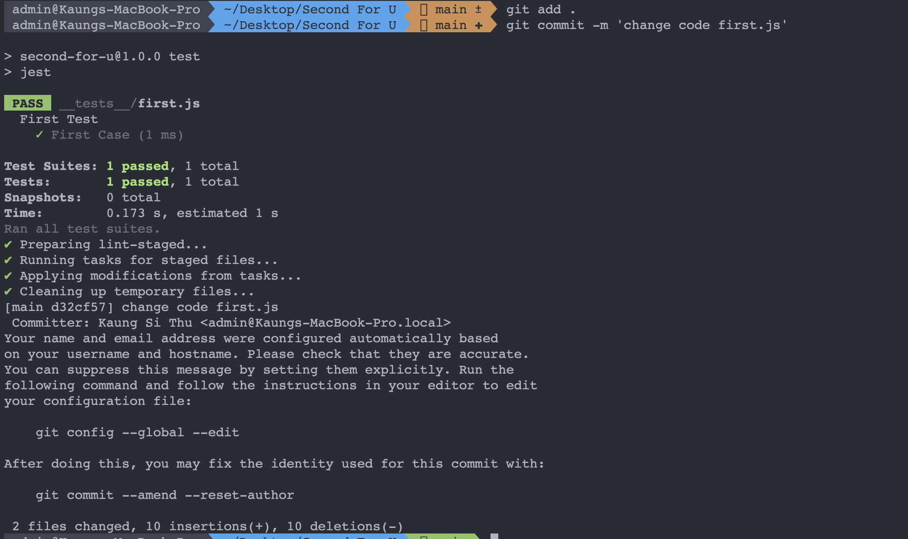

<h2>#Handling Code Review Feedback</h2>

// Code snippet 
function calculateSum(nums) {
let result = 0;
for (let num of nums) {
result = result + num;
}
return result;
}

// Feedback 
The code you provide can effect the performance of the project if it becomes too big. Consider any alternative built-in methods to handle the looping.

<h2>#Iterative Development Process</h2>

// Flowchart of iterative development process 

Got the feedback -> Think the code process again -> change the logic of the code -> test the newly changed code -> create the pull request -> review by other team members

<h2>#Resolving Merge Conflicts (Scenario)</h2>

I created two branches A and B to demonstrate the merge conflict

<ol>
    <li>In branchA, there is an app.js file with some code</li>
    <li>In branchB, there is an app.js file with some code, but here I add some extra code different from branch A</li>
    <li>Checkout to branch A again and modified the same file again</li>
    <li>After that merge the two branch by 'git merge brachB' from branchA</li>
    <li>Now We got merge conflict, as expected</li>
    <li>We can solve this issue, by making the two file to be one same page by fixing the conflict code lines.</li>
    <li>After fixing, we can merge smoothly</li>
</ol>

<h2>#CI/CD Integration</h2>

In nodeJS project for CI/CD integration we usually node modules like Jest, Husky, lint-staged and eslint for automated tests and quality checks.

Below screenshot is implementing pre-commit hook for automated tests

If I have any potential issue, I would first make understand the issue and then try a alternatie approach, get help form online communities like stackoverflow and use AI tools like chatgpt.

