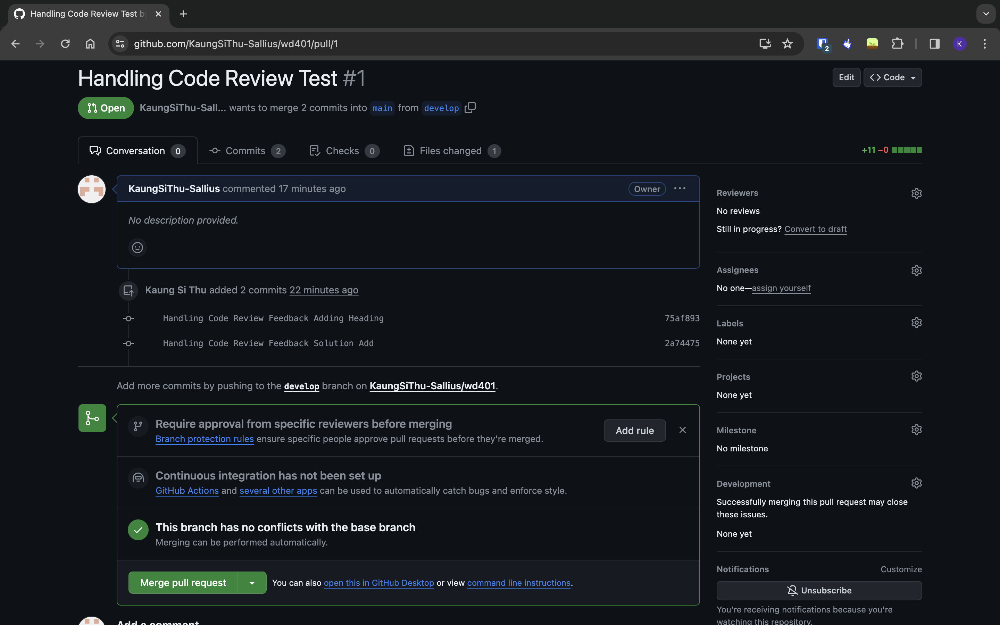

<h2>#Handling Code Review Feedback</h2>

// Code snippet 
class Product {
constructor(name, price, quantity) {
this.name = name;
this.price = price;
this.quantity = quantity;
}
}

class ShoppingCart {
constructor() {
this.products = [];
}

    addProduct(product) {
        this.products.push(product);
    }

    removeProduct(product) {
        const index = this.products.indexOf(product);
        if (index !== -1) {
            this.products.splice(index, 1);
        } else {
            console.log("Product not found in the shopping cart.");
        }
    }

    calculateTotalPrice() {
        let totalPrice = 0;
        this.products.forEach(product => {
            totalPrice += product.price * product.quantity;
        });
        return totalPrice;
    }

}

// Feedback 
Need an improvment addProduct method to check if the added item is an instance of the Product class before pushing it into the cart. Enhanced removeProduct method to remove a product based on its name and provided appropriate message.
Add displayProducts method to display the products in the cart.
Made "products" private to the ShoppingCart class for better encapsulation. Implemented a getter method using the get keyword to access the Products attribute.

<h2>#Iterative Development Process</h2>

// Flowchart of iterative development process 

Got the feedback -> Think the code process again -> change the logic of the code -> test the newly changed code -> create the pull request -> review by other team members

<h2>#Resolving Merge Conflicts (Scenario)</h2>

I created two branches A and B to demonstrate the merge conflict

<ol>
    <li>cmd: git checkout -b A  Create and Switch to branch A</li>
    <li>cmd: git pull origin A  Pull the latest code from remote</li>
    <li>
        In branch A, we write the following code,  
        function myFunction() {
            console.log("Changes in branch A");
        }          
    </li>
    <li>cmd: git checkout -b B  Create and Switch to branch B</li>
    <li>
        In branch B, we write the following code,  
        function myFunction() {
            console.log("Changes in branch B");
        }          
    </li>
    <li>Now we try to merge the two files with cmd: git merge A</li>
    <li>We will see there is a merge conflict in these two files</li>
    <li>Open the conflicting files. We will see the confliction sections like below  
    function myFunction() {
            <<<<<<< HEAD
            // Changes made in branch B
            console.log("Changes in branch B");
            =======
            // Changes made in branch A
            console.log("Changes in branch A");
            >>>>>>> A
        }
    </li>
    <li>We can fix it my editing the conflicting line to make same line in both files.</li>
    <li>After that we can just merge again and it will works this time</li>
</ol>

<h2>#CI/CD Integration</h2>

In nodeJS project for CI/CD integration we usually node modules like Jest, Husky, lint-staged and eslint for automated tests and quality checks. We can insatll those package by npm command.

Below screenshot is implementing pre-commit hook for automated tests

The following is the package.json file that implementd mentiond package is used for CI/CD intergration 

{
  "name": "second-for-u",
  "version": "1.0.0",
  "description": "",
  "main": "index.js",
  "scripts": {
    "test": "jest",
    "prepare": "husky install .husky"
  },
  "author": "Kaung Si Thu",
  "license": "ISC",
  "devDependencies": {
    "eslint": "^8.56.0",
    "eslint-config-standard": "^17.1.0",
    "eslint-plugin-import": "^2.29.1",
    "eslint-plugin-n": "^16.5.0",
    "eslint-plugin-promise": "^6.1.1",
    "husky": "^8.0.3",
    "jest": "^29.7.0",
    "lint-staged": "^15.2.0",
    "prettier": "^3.1.1"
  },
  "lint-staged": {
    "*.js": [
      "eslint",
      "prettier --write ."
    ]
  }
}

Whenever, I commit my project to git, it will perform teting, linting and others automatically.

The following is the unit test, that will test automatically when we commit the project to git which is exists in __tests__ folder 

describe("First Test", () => {
  test("First Case", () => {
    expect(true).toBe(true);
  });
});

//This is just a simple unit test

In order to able to perform automaticaly we used husky precommit hook and configure it.

<h2>#Potential Issues that can occur during CI/CD development</h2>
<ol>
    <li>If dependency installation fail, we can check node version and check the package.json file</li>
    <li>If test fails, we have to trace the program what went wrong and ensuere the unit test is right</li>
    <li>If linting fails, we can check the ESLint configuration and fix the linting errors and warning before commiting it.</li>
</ol>
